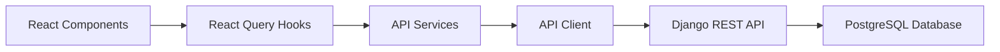
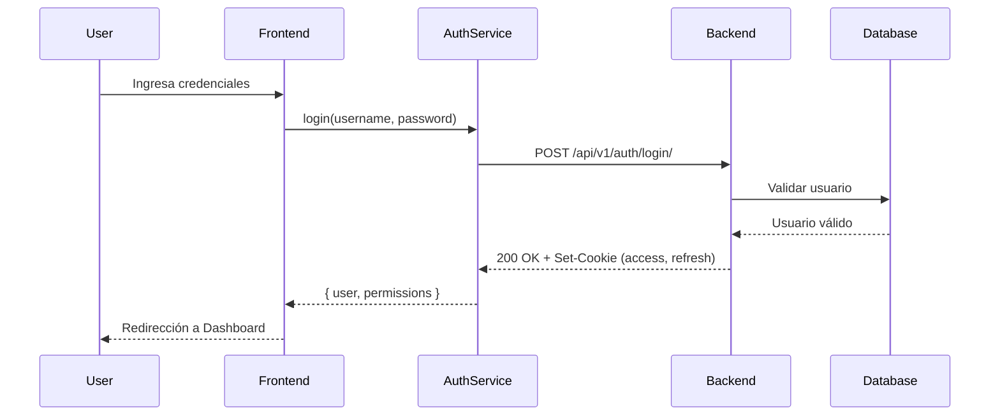

# API Integration - Frontend ↔ Backend

Guía de integración entre el frontend React y el backend Django REST Framework.

---

## 📋 Tabla de Contenidos

- [Arquitectura](#arquitectura)
- [Configuración](#configuración)
- [Autenticación](#autenticación)
- [Servicios API](#servicios-api)
- [React Query Integration](#react-query-integration)
- [Manejo de Errores](#manejo-de-errores)
- [Type Safety](#type-safety)

---

## 🏗️ Arquitectura



### Capas de la Arquitectura

1. **React Components**: UI components que consumen datos
2. **React Query Hooks**: Gestión de estado del servidor (cache, refetch, mutations)
3. **API Services**: Capa de abstracción para endpoints específicos
4. **API Client**: Cliente HTTP con interceptores y manejo de auth
5. **Django REST API**: Backend API con endpoints RESTful
6. **Database**: PostgreSQL con datos persistentes

---

## ⚙️ Configuración

### Variables de Entorno

**Frontend** (`.env`):
```env
# URL base del backend
VITE_API_BASE_URL=http://127.0.0.1:8000

# Ambiente
VITE_ENV=development
```

### API Client Base

**Archivo**: `src/lib/api.ts`

```typescript
import axios from 'axios';
import Cookies from 'js-cookie';

const API_BASE_URL = import.meta.env.VITE_API_BASE_URL || 'http://127.0.0.1:8000';

export const apiClient = axios.create({
  baseURL: API_BASE_URL,
  headers: {
    'Content-Type': 'application/json',
  },
  withCredentials: true, // Importante para cookies HttpOnly
});

// Request Interceptor - Agregar CSRF token
apiClient.interceptors.request.use(
  (config) => {
    const csrfToken = Cookies.get('csrftoken');
    if (csrfToken) {
      config.headers['X-CSRFToken'] = csrfToken;
    }
    return config;
  },
  (error) => Promise.reject(error)
);

// Response Interceptor - Manejo de errores global
apiClient.interceptors.response.use(
  (response) => response,
  async (error) => {
    const originalRequest = error.config;

    // Si token expiró (401), intentar refresh
    if (error.response?.status === 401 && !originalRequest._retry) {
      originalRequest._retry = true;

      try {
        await axios.post(`${API_BASE_URL}/api/v1/auth/refresh/`, {}, {
          withCredentials: true,
        });
        
        return apiClient(originalRequest);
      } catch (refreshError) {
        // Refresh falló, redirigir a login
        window.location.href = '/login';
        return Promise.reject(refreshError);
      }
    }

    return Promise.reject(error);
  }
);
```

---

## 🔐 Autenticación

### Flujo de Autenticación



### Auth Service

**Archivo**: `src/services/auth/authService.ts`

```typescript
import { apiClient } from '@/lib/api';
import type { User, LoginCredentials, LoginResponse } from '@/types/auth';

export const authService = {
  /**
   * Iniciar sesión
   */
  login: async (credentials: LoginCredentials): Promise<LoginResponse> => {
    const response = await apiClient.post<LoginResponse>(
      '/api/v1/auth/login/',
      credentials
    );
    return response.data;
  },

  /**
   * Cerrar sesión
   */
  logout: async (): Promise<void> => {
    await apiClient.post('/api/v1/auth/logout/');
  },

  /**
   * Obtener usuario actual
   */
  getCurrentUser: async (): Promise<User> => {
    const response = await apiClient.get<User>('/api/v1/auth/me/');
    return response.data;
  },

  /**
   * Verificar sesión
   */
  verifySession: async (): Promise<boolean> => {
    try {
      await apiClient.get('/api/v1/auth/verify/');
      return true;
    } catch {
      return false;
    }
  },
};
```

### Auth Context

**Archivo**: `src/context/AuthContext.tsx`

```typescript
import React, { createContext, useContext, useState, useEffect } from 'react';
import { authService } from '@/services/auth';
import type { User } from '@/types/auth';

interface AuthContextType {
  user: User | null;
  isAuthenticated: boolean;
  isLoading: boolean;
  login: (username: string, password: string) => Promise<void>;
  logout: () => Promise<void>;
}

const AuthContext = createContext<AuthContextType | undefined>(undefined);

export const AuthProvider: React.FC<{ children: React.ReactNode }> = ({ children }) => {
  const [user, setUser] = useState<User | null>(null);
  const [isLoading, setIsLoading] = useState(true);

  useEffect(() => {
    checkAuth();
  }, []);

  const checkAuth = async () => {
    try {
      const currentUser = await authService.getCurrentUser();
      setUser(currentUser);
    } catch {
      setUser(null);
    } finally {
      setIsLoading(false);
    }
  };

  const login = async (username: string, password: string) => {
    const response = await authService.login({ username, password });
    setUser(response.user);
  };

  const logout = async () => {
    await authService.logout();
    setUser(null);
  };

  return (
    <AuthContext.Provider
      value={{
        user,
        isAuthenticated: !!user,
        isLoading,
        login,
        logout,
      }}
    >
      {children}
    </AuthContext.Provider>
  );
};

export const useAuth = () => {
  const context = useContext(AuthContext);
  if (!context) {
    throw new Error('useAuth must be used within AuthProvider');
  }
  return context;
};
```

---

## 🔌 Servicios API

### Patrón de Servicio

Cada módulo del backend tiene un servicio correspondiente en el frontend.

**Estructura**:
```
src/services/
├── api/
│   └── apiClient.ts        # Cliente base
├── auth/
│   └── authService.ts      # Autenticación
├── empleados/
│   └── empleadosService.ts # Empleados CRUD
├── areas/
│   └── areasService.ts     # Áreas CRUD
└── vacaciones/
    └── vacacionesService.ts # Vacaciones
```

### Ejemplo: Empleados Service

**Archivo**: `src/services/empleados/empleadosService.ts`

```typescript
import { apiClient } from '@/services/api/apiClient';
import type { Empleado, EmpleadoCreate, EmpleadoUpdate } from '@/generated/models';

export const empleadosService = {
  /**
   * Obtener todos los empleados
   */
  getAll: async (params?: {
    page?: number;
    estado?: string;
    search?: string;
  }): Promise<{ results: Empleado[]; count: number }> => {
    const response = await apiClient.get('/api/v1/empleados/', { params });
    return response.data;
  },

  /**
   * Obtener empleado por ID
   */
  getById: async (id: number): Promise<Empleado> => {
    const response = await apiClient.get(`/api/v1/empleados/${id}/`);
    return response.data;
  },

  /**
   * Crear empleado
   */
  create: async (data: EmpleadoCreate): Promise<Empleado> => {
    const response = await apiClient.post('/api/v1/empleados/', data);
    return response.data;
  },

  /**
   * Actualizar empleado
   */
  update: async (id: number, data: EmpleadoUpdate): Promise<Empleado> => {
    const response = await apiClient.patch(`/api/v1/empleados/${id}/`, data);
    return response.data;
  },

  /**
   * Eliminar empleado
   */
  delete: async (id: number): Promise<void> => {
    await apiClient.delete(`/api/v1/empleados/${id}/`);
  },

  /**
   * Obtener estadísticas
   */
  getStats: async (): Promise<{
    total: number;
    activos: number;
    inactivos: number;
  }> => {
    const response = await apiClient.get('/api/v1/empleados/statistics/');
    return response.data;
  },
};
```

---

## 🔄 React Query Integration

### Query Client Setup

**Archivo**: `src/lib/queryClient.ts`

```typescript
import { QueryClient } from '@tanstack/react-query';

export const queryClient = new QueryClient({
  defaultOptions: {
    queries: {
      staleTime: 5 * 60 * 1000, // 5 minutos
      cacheTime: 10 * 60 * 1000, // 10 minutos
      retry: 1,
      refetchOnWindowFocus: false,
    },
    mutations: {
      retry: 0,
    },
  },
});
```

**Uso en app**:
```typescript
// src/main.tsx
import { QueryClientProvider } from '@tanstack/react-query';
import { queryClient } from '@/lib/queryClient';

ReactDOM.createRoot(document.getElementById('root')!).render(
  <QueryClientProvider client={queryClient}>
    <App />
  </QueryClientProvider>
);
```

---

### Custom Hooks

#### useEmpleados - Query Hook

**Archivo**: `src/features/empleados/hooks/useEmpleados.ts`

```typescript
import { useQuery } from '@tanstack/react-query';
import { empleadosService } from '@/services/empleados';

export const useEmpleados = (params?: {
  page?: number;
  estado?: string;
  search?: string;
}) => {
  return useQuery({
    queryKey: ['empleados', params],
    queryFn: () => empleadosService.getAll(params),
    staleTime: 5 * 60 * 1000,
  });
};

export const useEmpleado = (id: number) => {
  return useQuery({
    queryKey: ['empleados', id],
    queryFn: () => empleadosService.getById(id),
    enabled: !!id,
  });
};
```

#### useEmpleadoMutations - Mutation Hooks

```typescript
import { useMutation, useQueryClient } from '@tanstack/react-query';
import { empleadosService } from '@/services/empleados';
import { toast } from 'sonner';

export const useCreateEmpleado = () => {
  const queryClient = useQueryClient();

  return useMutation({
    mutationFn: empleadosService.create,
    onSuccess: () => {
      queryClient.invalidateQueries({ queryKey: ['empleados'] });
      toast.success('Empleado creado exitosamente');
    },
    onError: (error) => {
      toast.error('Error al crear empleado');
      console.error(error);
    },
  });
};

export const useUpdateEmpleado = () => {
  const queryClient = useQueryClient();

  return useMutation({
    mutationFn: ({ id, data }: { id: number; data: EmpleadoUpdate }) =>
      empleadosService.update(id, data),
    onSuccess: (_, variables) => {
      queryClient.invalidateQueries({ queryKey: ['empleados'] });
      queryClient.invalidateQueries({ queryKey: ['empleados', variables.id] });
      toast.success('Empleado actualizado');
    },
    onError: () => {
      toast.error('Error al actualizar empleado');
    },
  });
};

export const useDeleteEmpleado = () => {
  const queryClient = useQueryClient();

  return useMutation({
    mutationFn: empleadosService.delete,
    onSuccess: () => {
      queryClient.invalidateQueries({ queryKey: ['empleados'] });
      toast.success('Empleado eliminado');
    },
    onError: () => {
      toast.error('Error al eliminar empleado');
    },
  });
};
```

---

### Uso en Componentes

```typescript
// src/pages/EmpleadosPage.tsx
import { useEmpleados, useCreateEmpleado } from '@/features/empleados/hooks';

export const EmpleadosPage = () => {
  const [page, setPage] = useState(1);
  const [search, setSearch] = useState('');

  // Query
  const { data, isLoading, error } = useEmpleados({ page, search });

  // Mutation
  const createEmpleado = useCreateEmpleado();

  const handleCreate = async (formData: EmpleadoCreate) => {
    await createEmpleado.mutateAsync(formData);
  };

  if (isLoading) return <Loading />;
  if (error) return <Error message={error.message} />;

  return (
    <div>
      <h1>Empleados</h1>
      
      {/* Lista de empleados */}
      {data?.results.map(empleado => (
        <EmpleadoCard key={empleado.id} empleado={empleado} />
      ))}

      {/* Paginación */}
      <Pagination
        current={page}
        total={data?.count}
        onChange={setPage}
      />
    </div>
  );
};
```

---

## ⚠️ Manejo de Errores

### Error Types

```typescript
// src/types/errors.ts
export interface APIError {
  message: string;
  code: string;
  field?: string;
  details?: Record<string, string[]>;
}

export class APIException extends Error {
  code: string;
  statusCode: number;
  details?: Record<string, string[]>;

  constructor(error: any) {
    super(error.message || 'An error occurred');
    this.code = error.code || 'UNKNOWN_ERROR';
    this.statusCode = error.response?.status || 500;
    this.details = error.response?.data;
  }
}
```

### Error Boundary

```typescript
// src/components/common/ErrorBoundary.tsx
import React from 'react';

interface Props {
  children: React.ReactNode;
  fallback?: React.ReactNode;
}

interface State {
  hasError: boolean;
  error?: Error;
}

export class ErrorBoundary extends React.Component<Props, State> {
  constructor(props: Props) {
    super(props);
    this.state = { hasError: false };
  }

  static getDerivedStateFromError(error: Error): State {
    return { hasError: true, error };
  }

  componentDidCatch(error: Error, errorInfo: React.ErrorInfo) {
    console.error('Error caught by boundary:', error, errorInfo);
  }

  render() {
    if (this.state.hasError) {
      return this.props.fallback || (
        <div className="error-boundary">
          <h2>Algo salió mal</h2>
          <p>{this.state.error?.message}</p>
        </div>
      );
    }

    return this.props.children;
  }
}
```

### Error Handling en Servicios

```typescript
// src/services/empleados/empleadosService.ts
import { APIException } from '@/types/errors';

export const empleadosService = {
  getAll: async (params) => {
    try {
      const response = await apiClient.get('/api/v1/empleados/', { params });
      return response.data;
    } catch (error) {
      throw new APIException(error);
    }
  },
};
```

### Error Handling en Hooks

```typescript
// En componente
const { data, error, isError } = useEmpleados();

if (isError) {
  const apiError = error as APIException;
  
  switch (apiError.statusCode) {
    case 401:
      return <Redirect to="/login" />;
    case 403:
      return <Forbidden />;
    case 404:
      return <NotFound />;
    default:
      return <ErrorMessage error={apiError} />;
  }
}
```

---

## 🔒 Type Safety

### Generación de Tipos desde OpenAPI

**Script**: `scripts/generate-api-types.mjs`

```javascript
import { exec } from 'child_process';
import { promisify } from 'util';

const execAsync = promisify(exec);

async function generateTypes() {
  console.log('📡 Generando schema OpenAPI desde Django...');
  
  // 1. Generar schema desde Django
  await execAsync(
    'cd ../back && python scripts/generate_openapi_schema.py',
    { shell: true }
  );

  console.log('✅ Schema generado');

  console.log('🔧 Generando tipos TypeScript...');

  // 2. Generar tipos TypeScript
  await execAsync(
    'npx openapi-typescript openapi-schema.json -o src/generated/types.ts',
    { shell: true }
  );

  console.log('✅ Tipos TypeScript generados en src/generated/');
}

generateTypes().catch(console.error);
```

**Uso**:
```bash
npm run generate:api
```

---

### Tipos Generados

**Archivo**: `src/generated/models/Empleado.ts` (generado)

```typescript
export interface Empleado {
  id: number;
  nombres_empleado: string;
  apellido_paterno: string;
  apellido_materno: string | null;
  numero_documento: string;
  tipo_documento: 'DNI' | 'CE' | 'PASAPORTE';
  email: string;
  telefono: string | null;
  fecha_nacimiento: string;
  cargo: string;
  area: number;
  fecha_ingreso: string;
  estado: 'activo' | 'inactivo' | 'suspendido' | 'cesado';
  created_at: string;
  updated_at: string;
}

export interface EmpleadoCreate {
  nombres_empleado: string;
  apellido_paterno: string;
  apellido_materno?: string | null;
  numero_documento: string;
  tipo_documento: 'DNI' | 'CE' | 'PASAPORTE';
  email: string;
  telefono?: string | null;
  fecha_nacimiento: string;
  cargo: string;
  area: number;
  fecha_ingreso: string;
  estado?: 'activo' | 'inactivo' | 'suspendido' | 'cesado';
}

export interface EmpleadoUpdate extends Partial<EmpleadoCreate> {}
```

### Uso de Tipos

```typescript
import type { Empleado, EmpleadoCreate } from '@/generated/models';

// Servicio con tipos
export const empleadosService = {
  getAll: async (): Promise<Empleado[]> => {
    // TypeScript sabe que retorna Empleado[]
  },

  create: async (data: EmpleadoCreate): Promise<Empleado> => {
    // TypeScript valida que data cumple EmpleadoCreate
  },
};

// Componente con tipos
interface EmpleadoCardProps {
  empleado: Empleado; // Auto-complete y type checking
}
```

---

## 📊 API Endpoints Reference

### Autenticación

| Método | Endpoint | Descripción |
|--------|----------|-------------|
| POST | `/api/v1/auth/login/` | Login con username/password |
| POST | `/api/v1/auth/logout/` | Logout (invalida tokens) |
| POST | `/api/v1/auth/refresh/` | Renovar access token |
| GET | `/api/v1/auth/me/` | Obtener usuario actual |
| GET | `/api/v1/auth/verify/` | Verificar sesión |

### Empleados

| Método | Endpoint | Descripción |
|--------|----------|-------------|
| GET | `/api/v1/empleados/` | Listar empleados |
| POST | `/api/v1/empleados/` | Crear empleado |
| GET | `/api/v1/empleados/{id}/` | Detalle de empleado |
| PATCH | `/api/v1/empleados/{id}/` | Actualizar empleado |
| DELETE | `/api/v1/empleados/{id}/` | Eliminar empleado |
| GET | `/api/v1/empleados/statistics/` | Estadísticas |

### Áreas

| Método | Endpoint | Descripción |
|--------|----------|-------------|
| GET | `/api/v1/areas/` | Listar áreas |
| POST | `/api/v1/areas/` | Crear área |
| GET | `/api/v1/areas/{id}/` | Detalle de área |
| PATCH | `/api/v1/areas/{id}/` | Actualizar área |
| DELETE | `/api/v1/areas/{id}/` | Eliminar área |

### Vacaciones

| Método | Endpoint | Descripción |
|--------|----------|-------------|
| GET | `/api/v1/vacaciones/` | Listar solicitudes |
| POST | `/api/v1/vacaciones/` | Crear solicitud |
| GET | `/api/v1/vacaciones/{id}/` | Detalle de solicitud |
| PATCH | `/api/v1/vacaciones/{id}/` | Actualizar solicitud |
| POST | `/api/v1/vacaciones/{id}/approve/` | Aprobar solicitud |
| POST | `/api/v1/vacaciones/{id}/reject/` | Rechazar solicitud |
| GET | `/api/v1/vacaciones/balance/` | Saldo de vacaciones |

---

## 🔍 Debugging

### Herramientas

**React Query Devtools**:
```typescript
// src/App.tsx
import { ReactQueryDevtools } from '@tanstack/react-query-devtools';

function App() {
  return (
    <>
      <YourApp />
      <ReactQueryDevtools initialIsOpen={false} />
    </>
  );
}
```

**Axios Interceptor Logging**:
```typescript
// src/lib/api.ts
apiClient.interceptors.request.use(
  (config) => {
    console.log('🔵 Request:', config.method?.toUpperCase(), config.url, config.data);
    return config;
  }
);

apiClient.interceptors.response.use(
  (response) => {
    console.log('🟢 Response:', response.status, response.config.url);
    return response;
  },
  (error) => {
    console.error('🔴 Error:', error.response?.status, error.config?.url, error.response?.data);
    return Promise.reject(error);
  }
);
```

---

## 📚 Referencias

- [Django REST Framework](https://www.django-rest-framework.org/)
- [TanStack Query](https://tanstack.com/query/latest)
- [Axios Documentation](https://axios-http.com/)
- [OpenAPI TypeScript](https://github.com/drwpow/openapi-typescript)

---

**Última actualización**: 8 de marzo de 2026
